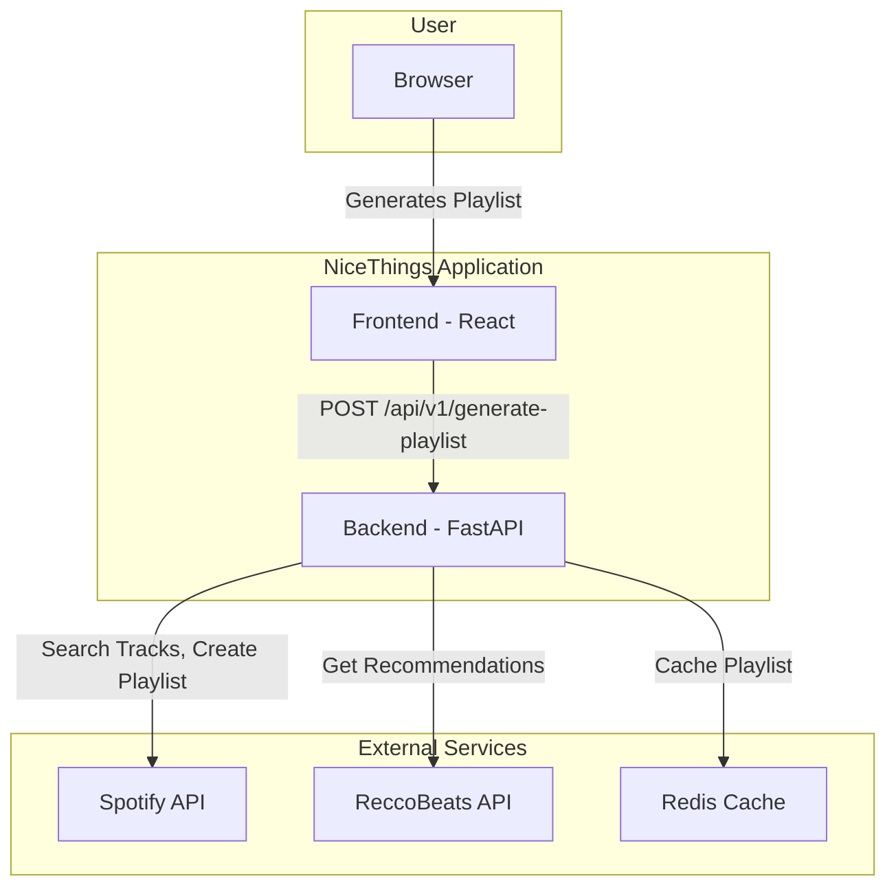

```mermaid
graph TD
    subgraph "User"
        A[Browser]
    end

    subgraph "NiceThings Application"
        B[Frontend - React]
        C[Backend - FastAPI]
    end

    subgraph "External Services"
        D[Spotify API]
        E[ReccoBeats API]
        F[Redis Cache]
    end

    A -- "Generates Playlist" --> B
    B -- "POST /api/v1/generate-playlist" --> C
    C -- "Search Tracks, Create Playlist" --> D
    C -- "Get Recommendations" --> E
    C -- "Cache Playlist" --> F
```
