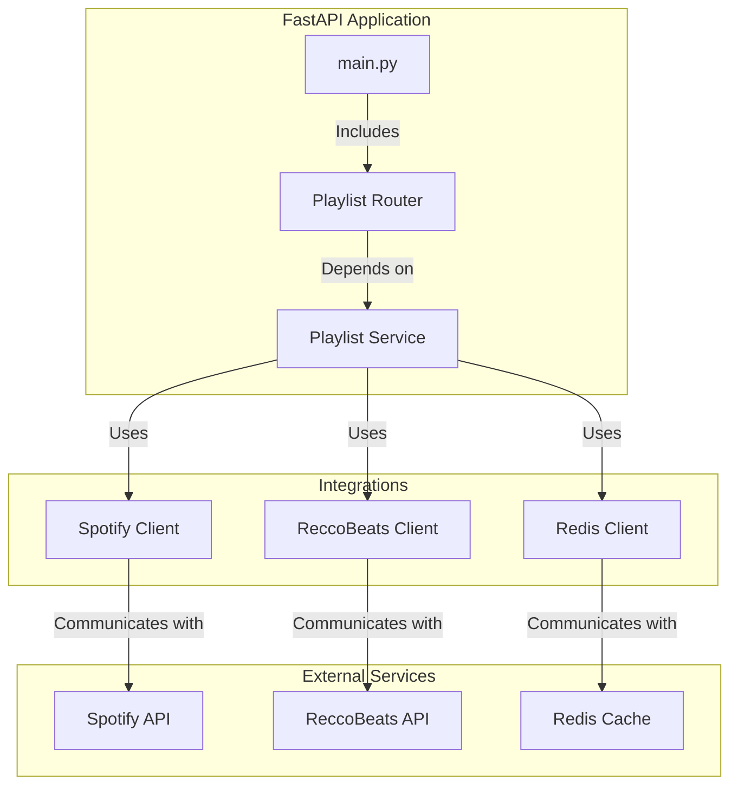

```mermaid
graph TD
    subgraph "FastAPI Application"
        A[main.py]
        B[Playlist Router]
        C[Playlist Service]
    end

    subgraph "Integrations"
        D[Spotify Client]
        E[ReccoBeats Client]
        F[Redis Client]
    end

    subgraph "External Services"
        G[Spotify API]
        H[ReccoBeats API]
        I[Redis Cache]
    end

    A -- "Includes" --> B
    B -- "Depends on" --> C
    C -- "Uses" --> D
    C -- "Uses" --> E
    C -- "Uses" --> F
    D -- "Communicates with" --> G
    E -- "Communicates with" --> H
    F -- "Communicates with" --> I
```
